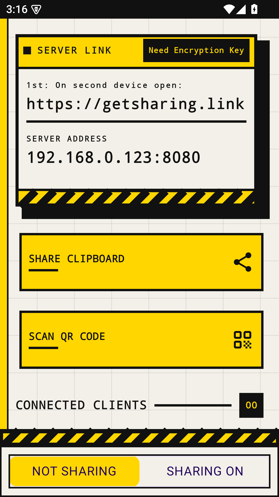

# easy2share

> Share clipboard & files from Android to any device — no cloud, no installs.

---

**easy2share** runs an encrypted local-network server on your phone. Open the link on your PC, scan the QR code once to establish a secure session, and start sharing instantly.



## Features

- 📋 **Clipboard sharing** — push text to any browser in one tap
- 📎 **File sharing** — pick one or more files and stream them to the browser, ready to download
- 🔒 **End-to-end encrypted** — ChaCha20-Poly1305 with a session key handed over by QR code scan
- 🌐 **Zero server** — everything stays on your local network
- 📦 **No PC software** — just a browser tab

## Protocol

The phone runs a WebSocket endpoint at `/notify`. Every frame is a CBOR `EncryptedMessage`
whose payload is `ciphertext || tag || nonce`, encrypted with ChaCha20-Poly1305 under the
key the browser generated and the phone scanned. Decrypting a frame yields another CBOR
message:

| Message | Distinguished by | Purpose |
| --- | --- | --- |
| Handshake response | `isOk` | Result of client registration |
| Clipboard push | `clipboard` | Text copied on the phone |
| `fileTransferStart` | `type` | Announces `fileName`, `mimeType`, `fileSize`, `chunkCount` |
| `fileChunk` | `type` | One 128 KB slice, carrying `chunkIndex` |
| `fileTransferEnd` | `type` | Marks the transfer complete or failed |

Files are streamed rather than buffered, and each chunk is encrypted on its own with a
fresh nonce — the same path clipboard pushes take. Every file transfer message also carries
a `fileId`, so several files may be in flight over a single connection.

The browser client lives in a [separate repository](https://github.com/marek-szanyi/easy2share-web).

## Tech stack

`Kotlin` · `Jetpack Compose` · `Ktor / Netty` · `Hilt` · `CameraX` · `ML Kit`

## Requirements

- Android 15+ (API 35)
- Wi-Fi

## Build

```sh
./gradlew assembleRelease
```

Run the unit tests, including the protocol contract and architecture checks:

```sh
./gradlew testDebugUnitTest
```

## License

[MIT](LICENSE.md) © 2026 Eaxor LLC
